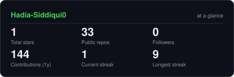
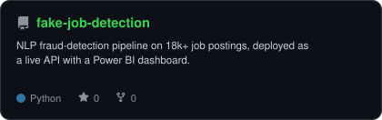
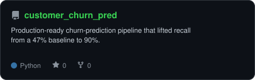
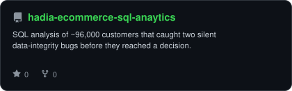
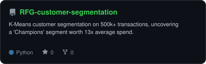
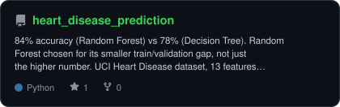
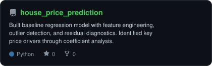

<div align="center">

<picture>
  <source media="(prefers-color-scheme: dark)" srcset="assets/portrait.svg">
  <source media="(prefers-color-scheme: light)" srcset="assets/portrait.svg">
  
</picture>


<a href="https://linkedin.com/in/hadia-siddiqui-8255262b7"></a>
<a href="mailto:hadiasiddiqui122@gmail.com"></a>
<a href="https://hadia-siddiqui.netlify.app"></a>


</div>

<br>

## `SELECT * FROM about_me;`

```sql
about_me
name         : Hadia Siddiqui
role         : Data Scientist / ML Engineer
based_in     : Karachi, Pakistan
stack        : Python, SQL, scikit-learn, FastAPI, Docker
currently    : building an AI business-intelligence platform for textile & fashion manufacturers
```

- 1. Currently building **[Textile/Fashion AI BI Platform](#)** early stage, more soon
- 2. Best result so far: lifted churn-model recall from a 47% baseline to **90%**
- 3. Also work in NLP fraud detection on 18k+ job postings, deployed as a live API
- 4. Portfolio: **[hadia-siddiqui.netlify.app](https://hadia-siddiqui.netlify.app)**

<br>

## `~/toolbox`

<div align="center">

</div>

<br>

## `~/skills`

<table><tr>
<td width="50%" align="center">

<picture>
  <source media="(prefers-color-scheme: dark)" srcset="assets/radar-dark.svg">
  <source media="(prefers-color-scheme: light)" srcset="assets/radar-light.svg">
  
</picture>

<sub>self-rated</sub>

</td>
<td width="50%" align="center">

<picture>
  <source media="(prefers-color-scheme: dark)" srcset="assets/radar-langs-dark.svg">
  <source media="(prefers-color-scheme: light)" srcset="assets/radar-langs-light.svg">
  
</picture>

<sub>from GitHub API</sub>

</td>
</tr></table>

<br>

## `~/stats`

<div align="center">

<picture>
  <source media="(prefers-color-scheme: dark)" srcset="assets/card-stats-dark.svg">
  <source media="(prefers-color-scheme: light)" srcset="assets/card-stats-light.svg">
  
</picture>

</div>

<br>

## `~/projects`

<table><tr>
<td width="33%">
<a href="https://github.com/Hadia-Siddiqui0/fake-job-detection">
<picture>
  <source media="(prefers-color-scheme: dark)" srcset="assets/card-fake-job-detection-dark.svg">
  <source media="(prefers-color-scheme: light)" srcset="assets/card-fake-job-detection-light.svg">
  
</picture>
</a>
</td>
<td width="33%">
<a href="https://github.com/Hadia-Siddiqui0/customer_churn_pred">
<picture>
  <source media="(prefers-color-scheme: dark)" srcset="assets/card-customer_churn_pred-dark.svg">
  <source media="(prefers-color-scheme: light)" srcset="assets/card-customer_churn_pred-light.svg">
  
</picture>
</a>
</td>
<td width="33%">
<a href="https://github.com/Hadia-Siddiqui0/hadia-ecommerce-sql-anaytics">
<picture>
  <source media="(prefers-color-scheme: dark)" srcset="assets/card-hadia-ecommerce-sql-anaytics-dark.svg">
  <source media="(prefers-color-scheme: light)" srcset="assets/card-hadia-ecommerce-sql-anaytics-light.svg">
  
</picture>
</a>
</td>
</tr><tr>
<td width="33%">
<a href="https://github.com/Hadia-Siddiqui0/RFG-customer-segmentation">
<picture>
  <source media="(prefers-color-scheme: dark)" srcset="assets/card-RFG-customer-segmentation-dark.svg">
  <source media="(prefers-color-scheme: light)" srcset="assets/card-RFG-customer-segmentation-light.svg">
  
</picture>
</a>
</td>
<td width="33%">
<a href="https://github.com/Hadia-Siddiqui0/heart_disease_prediction">
<picture>
  <source media="(prefers-color-scheme: dark)" srcset="assets/card-heart_disease_prediction-dark.svg">
  <source media="(prefers-color-scheme: light)" srcset="assets/card-heart_disease_prediction-light.svg">
  
</picture>
</a>
</td>
<td width="33%">
<a href="https://github.com/Hadia-Siddiqui0/house_price_prediction">
<picture>
  <source media="(prefers-color-scheme: dark)" srcset="assets/card-house_price_prediction-dark.svg">
  <source media="(prefers-color-scheme: light)" srcset="assets/card-house_price_prediction-light.svg">
  
</picture>
</a>
</td>
</tr></table>

<sub>

| Project                                                                                          | What it does                                                                                                       | Stack                                                   |
| ------------------------------------------------------------------------------------------------ | ------------------------------------------------------------------------------------------------------------------ | ------------------------------------------------------- |
| [NLP Fake Job Posting Detection](https://github.com/Hadia-Siddiqui0/fake-job-detection)          | TF-IDF + Chi-Square fraud detection on 18k+ postings, deployed as a live API with a Power BI dashboard             | Python, scikit-learn, TF-IDF, FastAPI, Docker, Power BI |
| [Customer Churn Prediction](https://github.com/Hadia-Siddiqui0/customer_churn_pred)              | Random Forest pipeline tuned with GridSearchCV, recall lifted from 47% baseline to 90%                             | Python, scikit-learn, FastAPI, Docker                   |
| [E-Commerce Customer Analytics](https://github.com/Hadia-Siddiqui0/hadia-ecommerce-sql-anaytics) | SQL analysis across ~96,000 customers; caught two silent data-integrity bugs before they reached a decision        | MySQL, SQL                                              |
| [RFM Customer Segmentation](https://github.com/Hadia-Siddiqui0/RFG-customer-segmentation)        | K-Means clustering on 500k+ transactions; validated with silhouette score, found a 13x-value "Champions" segment   | Python, scikit-learn, K-Means                           |
| [Heart Disease Prediction](https://github.com/Hadia-Siddiqui0/heart_disease_prediction)          | Random Forest (84%) chosen over Decision Tree (78%) for a smaller train/validation gap, not just the higher number | Python, scikit-learn, Random Forest                     |
| [House Price Prediction](https://github.com/Hadia-Siddiqui0/house_price_prediction)              | Baseline regression with feature engineering, outlier detection, and residual diagnostics                          | Python, scikit-learn, Linear Regression                 |

</sub>

<br>

<div align="center">


</div>

<br>

<div align="center">
<sub>01000100 01100001 01110100 01100001 — "Data"</sub>
</div>
